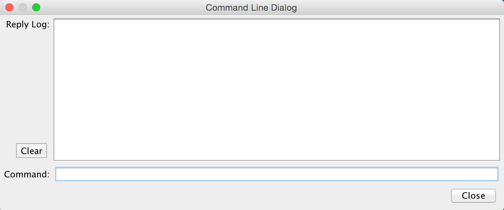

# Programmatic Access to Cytoscape Features (Scripting)

## Programmatic Access to Cytoscape Features

In this chapter, you will learn how to use Cytoscape from the command
line and scripts. These features replace the ***Scripting*** module in
past versions of Cytoscape.

## Topics

-   ***Commands***

-   **RESTful API**

    -   **Command REST API**

    -   **cyREST**

## Background

Cytoscape's intuitive graphical user interface is useful for
*interactive* network data integration, analysis, and visualization. It
provides great features for exploratory data analysis, but what happens
if you have hundreds of data files or need to ask someone to execute
your data analysis workflows? It is virtually impossible to apply the
same operations to hundreds of networks manually using a GUI. More
importantly, although you can save your ***results*** as session files,
you cannot save your ***workflows*** if you perform your data analysis
with point-and-click GUI operations. Cytoscape has several options that
support scripting and automating your workflows: Commands and RESTful
API.

The Command feature allows you to script a number of Cytoscape commands
and menu items, and commands can have parameter values that would
normally be provided by a user via Cytoscape dialog box. For example,
*session open file="C:\\myfile.cys"* loads a session from a file
similarly to the **File | Open** menu item. You can create a command
script file that Cytoscape can execute via the **Tools | Execute Command
File** menu item or on the Cytoscape command line at startup.

The RESTful API feature allows you to access Cytoscape from a separate
application, thereby orchestrating Cytoscape operations from that
application. The application may be written in a general programming
language (e.g., Python) that keeps its own data structures, performs
complex flow control, or directly manipulates Cytoscape nodes, edges,
attributes, and visual styles.

The Command feature is useful for executing sequences of commands,
whereas the RESTful API feature is useful when Cytoscape is to be used
as a service relative to an application.

### Commands

***Commands*** is the built-in Cytoscape feature to automate your
workflow as simple script. You can learn more about this feature in this
section:

-   [Command
    Tool](http://cytoscape-working-copy.readthedocs.org/en/latest/Chapter_16_Command_Tool.html#command-tool)

### RESTful API

In some cases, you may need to use fully featured programming languages,
such as Python, R, Ruby, or
[JavaScript](https://en.wikipedia.org/wiki/JavaScript)
to script your workflow. Such languages enable complex control and data
structures, and Cytoscape would be called as a service. For such use
cases, accessing Cytoscape via REST API is the right option.

Cytoscape offers two flavors of REST-style control: REST Commands and
cyREST. REST Commands uses a REST interface to issue script commands.
cyREST uses a REST interface to access the Cytoscape data model as a
document via a formal API.

#### 1. REST API for Commands

In addition to running Command scripts, Command module has REST API to
enable command execution from another program.

By default, this feature is disabled. To enable the REST API server for
Commands, please follow these steps:

1.  Open a terminal session:

    -   [PowerShell](https://en.wikipedia.org/wiki/Windows_PowerShell)
        or Command (For windows)

    -   Terminal or [iTerm2](https://www.iterm2.com/) (For Mac)

    -   Terminal (For Linux)

2.  Start Cytoscape from command-line. You must specify a TCP/IP port
    number as a parameter -- in this example, port 8888 will be opened
    for Command:

    -   For Mac/Linux

            ./cytoscape.sh -R 8888

        For Windows

            ./cytoscape.bat -R 8888

3.  To test the Command interface, open the following URL with your web
    browser:

    -   http://localhost:8888/v1/commands

4.  If you see list of available commands, you are ready to use Command
    API

    

#### 2. cyREST

**[cyREST](http://apps.cytoscape.org/apps/cyrest) is a
language-agnostic, programmer-friendly RESTful API module for
Cytoscape**. If you want to build your own workflow with
[R](http://www.r-project.org/), [Python](https://www.python.org/) or
other programming languages along with Cytoscape, this is the option for
you. You can use popular tools, including IPython/Jupyter Notebook and
RStudio as your orchestration tool for your data visualization workflow
with Cytoscape.

(Sample [Jupyter
Notebook](http://nbviewer.ipython.org/github/idekerlab/py2cytoscape/blob/develop/examples/New_wrapper_api_sample.ipynb)
written with cyREST and
[py2cytoscape](https://github.com/idekerlab/py2cytoscape))

Currently, cyREST is available as an App for Cytoscape 3.2.1 and later,
and requires the Java 8 (or later) virtual machine. As of Cytoscape
v3.3, cyREST is installed automatically with Cytoscape. Please visit the
link below for more information.

-   [cyREST App Store page](http://apps.cytoscape.org/apps/cyrest)
