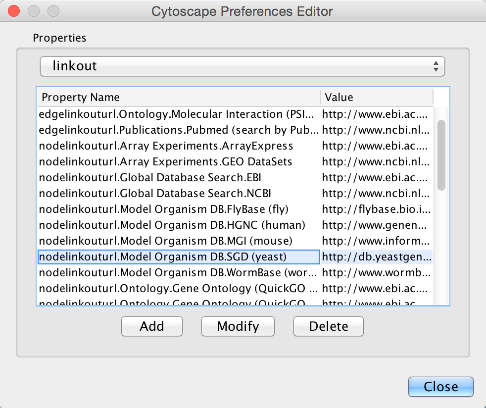
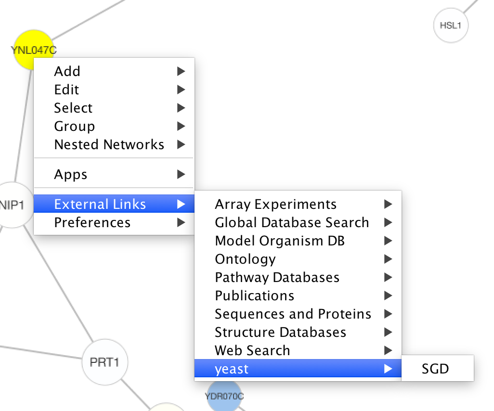

# Linkout

Linkout provides a mechanism to link nodes and edges to external web
resources within Cytoscape. Right-clicking on a node or edge in
Cytoscape opens a popup menu with a list of web links.

The external links are specified in a `linkout.props` file which is
internal to Cytoscape. The defaults include a number of links such as
Entrez, SGD and Google, as well as a number of species-specific
links. In addition to the default links, users can customize the
**External Links** menu and add (or remove) links by using the Cytoscape
Preferences Editor (found under **Edit → Preferences → Properties...** 
in the *linkout* group).

External links are listed as *'key'-'value'* pairs in the
editor where *Property Name* specifies the name of the link and
*Value* is the search URL. LinkOut menus are organized in a
hierarchical structure that is specified as part of the key. Linkout key terms
specific to nodes start with the keyword `nodelinkouturl`; for edges
this is `edgelinkouturl`.

For example, the following entry:

    nodelinkouturl.Model Organism DB.SGD (yeast)=http://www.yeastgenome.org/cgi-bin/locus.fpl?locus=%ID%

places the SGD link under the Model Organism DB submenu. This link will
appear in Cytoscape as:

In a similar fashion one can add new submenus.

The **`%ID%`** string in the URL is a place-holder for the node label.
When the popup menu is generated this marker is substituted with the
node label. In the above example, the generated SGD link for the YNL050C
protein is:

    http://www.yeastgenome.org/cgi-bin/locus.fpl?locus=YNL050C

If you want to query based on a different column, you need to specify a
different node label using Styles.

For edges the mechanism is much the same; however here the placeholders
**`%ID1%`** and **`%ID2%`** reflect the source and target node label
respectively.

Currently there is no mechanism to check whether the constructed URL
query is correct and if the node label is meaningful. Similarly, there
is no ID mapping between various identifiers. For example, a link to
NCBI Entrez from a network that uses Ensembl gene identifiers as node
labels will produce a link to Entrez using the Ensembl ID, which results
in an incorrect link. It is the user's responsibility to ensure that the
node label that is used as the search term in the URL link will result
in a meaningful link.

## Adding and Removing Links

The default links are defined in a `linkout.props` file contained in the 
[CytoscapeConfiguration directory](http://manual.cytoscape.org/en/3.4.0/Launching_Cytoscape.html?highlight=cytoscapeconfiguration#downloading-and-installing). These links are normal Java properties and can
be edited by using the Cytoscape Configuration Editor (**Edit → Preferences → Properties...**) and
selecting *linkout* from the box (shown below). 

In addition, new links can be defined when starting Cytoscape from
command line by specifying individual properties. The formatting of the
command is ` cytoscape.sh -P [context_menu_definition]=[link] `.
*context\_menu\_definition* specifies the context menu for showing the
linkout menu item. The structure of this definition is *nodelinkouturl* or *edgelinkouturl* followed by
"." and followed by the the "."-separated menu hierarchy.

For instance this command:

    cytoscape.sh -P nodelinkouturl.yeast.SGD=http://db.yeastgenome.org/cgi-bin/locus.pl?locus\=%ID%

will add this menu item:

To remove a link from the menu, simply delete the property using **Edit
→ Preferences → Properties...** and selecting *commandline*. Linkouts
added in the command line will be available for the running instance of
Cytoscape.
